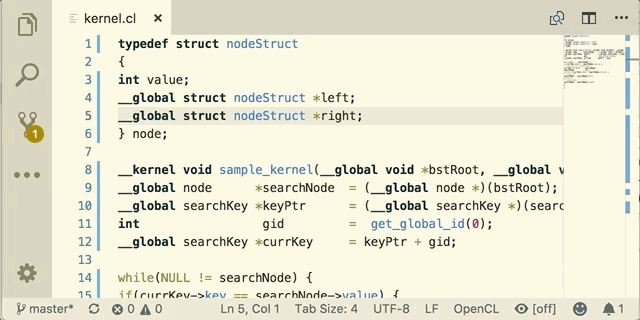

# OpenCL for Visual Studio Code

This extension adds:

* Support for file extensions: `.cl` and `.ocl`
* OpenCL C keywords syntax highlighting
* OpenCL C++ keywords syntax highlighting
* Auto-Completion (Built-in OpenCL functions, data types and macros)
* Hover tooltip for OpenCL Runtime
* Code Snippets for some host and device functions ([list of functions](https://raw.githubusercontent.com/Galarius/vscode-opencl/master/snippets/code.snippets.progress.md))
* Command `OpenCL: Info` to show OpenCL platforms/devices info. (`linux` is not supported yet)
* Support for external formatters (e.g. [AStyle](http://astyle.sourceforge.net))

||
|-|
|*Syntax Highlighting, Auto-Completion*|
||
|*Code Snippets*|
||
|*OpenCL platforms/devices info*|
||
|*Hover tooltip for OpenCL Runtime*|
||
|*Source code formatting*|
||

## Prerequisites

*[Required]*

* [Visual Studio Code](https://code.visualstudio.com)

*[Optional]*

In order to run command `OpenCL: Info` on Windows:

* Check that you have a device that supports OpenCL;
* Make sure your OpenCL device driver is up to date. You can download drivers manually: [Intel](https://software.intel.com/en-us/articles/opencl-drivers), [NVidia](http://www.nvidia.com/Download/index.aspx), [AMD](http://support.amd.com/en-us/download).

## How To Install

See [INSTALL.md](https://github.com/Galarius/vscode-opencl/blob/master/INSTALL.md)

## How To Use

* Open any `.cl` or `.ocl` file in VS Code to activate syntax highlighting, auto-completion, code snippets and document formatting for OpenCL kernel files.

* Open any file associated with `C` or `C++` language in VS Code to activate code snippets for OpenCL functions.

### Formatting Configuration

* `opencl.formatting.enabled` - Enable/Disable code formatting for OpenCL (Restart is required);

* `opencl.formatting.name` - The file name of the formatting utility (Should be available at `$PATH`, otherwise specify full file name);

* `opencl.formatting.args` - Array of command line options.

[AStyle](http://astyle.sourceforge.net)  formatting utility is used by default. If workspace contains AStyle configuration file `.astylerc`, add the following option to `opencl.formatting.args` in workspace configuration: `--options=${workspaceRoot}/.astylerc`.

## Contributing

See [CONTRIBUTING.md](https://github.com/Galarius/vscode-opencl/blob/master/CONTRIBUTING.md)

## FAQ

See [FAQ.md](https://github.com/Galarius/vscode-opencl/blob/master/FAQ.md)

## Change Log

See [CHANGELOG.md](https://marketplace.visualstudio.com/items/galarius.vscode-opencl/changelog)

## License

See [LICENSE.txt](https://raw.githubusercontent.com/Galarius/vscode-opencl/master/LICENSE.txt)