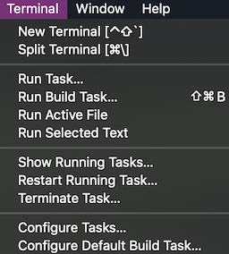
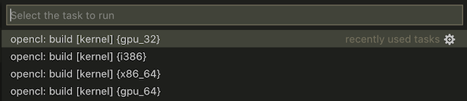

# OpenCL for Visual Studio Code

[](https://marketplace.visualstudio.com/items?itemName=galarius.vscode-opencl)
[](https://marketplace.visualstudio.com/items?itemName=galarius.vscode-opencl)

This extension adds OpenCL C/C++ language support to [VS Code](https://code.visualstudio.com).

## Features

* OpenCL Compute Kernel Support [`*.cl`, `*.ocl`]
* OpenCL C/C++ Syntax Highlighting
* Auto Completion of Built-in OpenCL Symbols
* Offline Kernel Compilation
* Built-in OpenCL API Reference
* Code Snippets ([details](https://raw.githubusercontent.com/Galarius/vscode-opencl/master/snippets/code.snippets.progress.md))
* Support for External Code Formatters (e.g. [AStyle](http://astyle.sourceforge.net))
* OpenCL Platforms & Devices Info

## Prerequisites

* OpenCL Drivers [[Intel](https://software.intel.com/en-us/articles/opencl-drivers), [NVidia](http://www.nvidia.com/Download/index.aspx), [AMD](http://support.amd.com/en-us/download)]
* [Intel OpenCL SDK](https://software.intel.com/en-us/articles/opencl-drivers) [Windows, Linux]
* OpenCL.framework [macOS]

## How to use this extension?

Install and open [VS Code](https://code.visualstudio.com). Press `Ctrl+Shift+X` or `Cmd+Shift+X` to open the Extensions pane. Find and install the `OpenCL` extension. You can also install the extension from the Marketplace ([Installation Guide](https://github.com/Galarius/vscode-opencl/blob/master/INSTALL.md)). Open any `.cl` or `.ocl` file in VS Code to activate syntax highlighting, auto-completion, code snippets, API reference tooltips and document formatting for OpenCL kernel files. Open any file associated with `C` or `C++` language in VS Code to activate code snippets for OpenCL host device functions.

The extension uses a set of tools to provide offline compilation and OpenCL devices/platforms information. By default `ioc32/ioc64` offline compiler is used on `Linux` and `Windows` and `openclc` is used on `macOS`. This requires [Intel OpenCL SDK](https://software.intel.com/en-us/articles/opencl-drivers) [Windows, Linux] to be installed on the system. For macOS `openclc` should be a part of `OpenCL.framework`. It is possible to customize command and arguments (see [Offline Kernel Compilation](#offline-kernel-compilation) for details).

## Offline Kernel Compilation

This extension provides predefined set of VS Code tasks for kernel compilation using `ioc32/ioc64` or `openclc` (on macOS). To run compilation/build task:

### Run Predefined Task

1. Press `Tasks > Run Task...` (fig. 1)

    

    *Figure 1. Tasks menu.*

2. Press `Run Task...` and select one of the predefined `opencl` tasks for file `kernel.cl`. The set of tasks (fig. 2) is generated for each kernel that was found in the current workspace.

    

    *Figure 2. Predefined Tasks for `ioc64` compiler.*

### Configure Default Build Task

Press `Tasks > Configure Default Build Task...`. Select one of the predefined `opencl` tasks. File `tasks.json` will be created (or extended) with configuration of the selected task (fig. 3). Press `Ctrl+Shift+B` to call it with the shortcut.


*Figure 3. Default Build Task Configuration.*

### Customize Build Task

> ToDo configure shortcuts

Press `Tasks > Configure Tasks...`. Select one of the predefined `opencl` tasks. File `tasks.json` will be created (or extended) with configuration of the selected task.

You can override `command` and `args` fields to use another compiler. Field `label` is a displayed task name, `problemMatcher` should be overriten to match a compiler's errors/warnings so messages could be displayed in `Problems` view.

An example of modified `tasks.json` configuration file to use [clc](cls) as OpenCL compiler:

```json
{
    "version": "2.0.0",
    "tasks": [
        {
            "type": "shell",
            "label": "opencl: custom build [kernel] {spirv64}",
            "task": "build",
            "command": "clc",
            "args": [
                
            ],
            "problemMatcher": [
                {
                    "owner": "opencl",
                "fileLocation": "absolute",
                "pattern": {
                    "regexp": "^(.*):(\\d+):(\\d+): ((fatal )?error|warning|Scholar): (.*)$",
                    "file": 1,
                    "line": 2,
                    "column": 3,
                    "severity": 4,
                    "message": 6
                }
                }
            ]
        }
    ]
}
```

## Formatting Configuration

* `opencl.formatting.enabled` - Enable / Disable code formatting for OpenCL (Restart is required);
* `opencl.formatting.name` - The file name of the formatting utility (Should be available at `$PATH`, otherwise specify full file name);
* `opencl.formatting.args` - An array of command line options.
[AStyle](http://astyle.sourceforge.net) formatting utility is used by default. If workspace contains AStyle configuration file `.astylerc`, add `--options=${workspaceRoot}/.astylerc` option to `opencl.formatting.args` in a workspace configuration.

## Commands

1. Press `Ctrl+Shift+P` or `Cmd+Shift+P`
2. Type `OpenCL: Info`

## Contributing

[Contributing Guide](https://github.com/Galarius/vscode-opencl/blob/master/CONTRIBUTING.md)

## Change Log

[OpenCL for VS Code Change Log](https://marketplace.visualstudio.com/items/galarius.vscode-opencl/changelog)

## License

[MIT License](https://raw.githubusercontent.com/Galarius/vscode-opencl/master/LICENSE.txt)